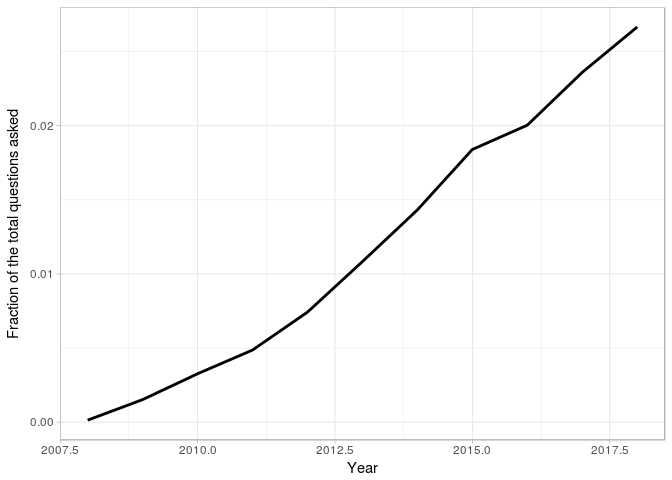
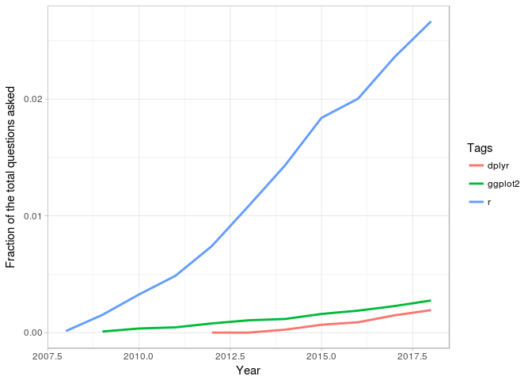
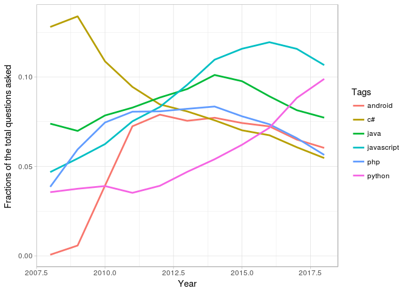
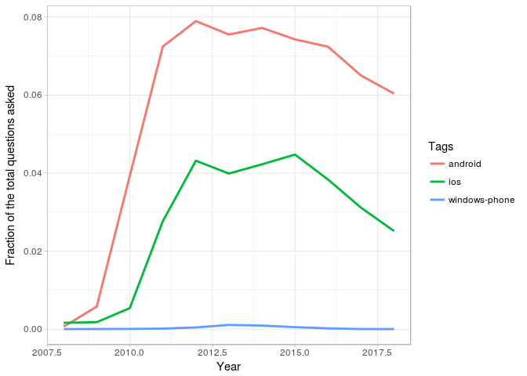

Let us find the trends in the programming language world. What languages
are growing and which are shrinking so that we can tell which are most
worth investing time in?

One excellent source of data on the popularity of programming languages
is [Stack Overflow](https://stackoverflow.com/). Each Stack Overflow
question has a **tag**, which marks a question describing its topic or
technology. For instance, there's a tag for languages like
[R](https://www.r-project.org/), [Python](https://www.python.org/) or
[Perl](https://perl6.org/) and for packages like
[ggplot2](https://ggplot2.tidyverse.org/).

We'll be working with a dataset with one observation for each tag each
year. The dataset includes both the number of questions asked in that
tag that year and the total number of questions asked in that year.

### Load the libraries and the data

    library("tidyverse")
    library("knitr")
    data <- read_csv("by_tag_year.csv")
    kable(head(data))

<table>
<thead>
<tr class="header">
<th align="right">year</th>
<th align="left">tag</th>
<th align="right">number</th>
<th align="right">year_total</th>
</tr>
</thead>
<tbody>
<tr class="odd">
<td align="right">2008</td>
<td align="left">.htaccess</td>
<td align="right">54</td>
<td align="right">58390</td>
</tr>
<tr class="even">
<td align="right">2008</td>
<td align="left">.net</td>
<td align="right">5910</td>
<td align="right">58390</td>
</tr>
<tr class="odd">
<td align="right">2008</td>
<td align="left">.net-2.0</td>
<td align="right">289</td>
<td align="right">58390</td>
</tr>
<tr class="even">
<td align="right">2008</td>
<td align="left">.net-3.5</td>
<td align="right">319</td>
<td align="right">58390</td>
</tr>
<tr class="odd">
<td align="right">2008</td>
<td align="left">.net-4.0</td>
<td align="right">6</td>
<td align="right">58390</td>
</tr>
<tr class="even">
<td align="right">2008</td>
<td align="left">.net-assembly</td>
<td align="right">3</td>
<td align="right">58390</td>
</tr>
</tbody>
</table>

### Convert into fraction

This data has one observation for each pair of a tag and a year, showing
the number of questions asked in that tag in that year and the total
number of questions asked in that year. For instance, there were 54
questions asked about the `.htaccess` tag in 2008, out of a total of
58390 questions in that year. Rather than just count, we're probably
interested in a percentage: the fraction of questions that year that
have that tag. So let's add that to the table.

    data <- mutate(data, fraction = number/year_total)
    kable(head(data))

<table>
<thead>
<tr class="header">
<th align="right">year</th>
<th align="left">tag</th>
<th align="right">number</th>
<th align="right">year_total</th>
<th align="right">fraction</th>
</tr>
</thead>
<tbody>
<tr class="odd">
<td align="right">2008</td>
<td align="left">.htaccess</td>
<td align="right">54</td>
<td align="right">58390</td>
<td align="right">0.0009248</td>
</tr>
<tr class="even">
<td align="right">2008</td>
<td align="left">.net</td>
<td align="right">5910</td>
<td align="right">58390</td>
<td align="right">0.1012160</td>
</tr>
<tr class="odd">
<td align="right">2008</td>
<td align="left">.net-2.0</td>
<td align="right">289</td>
<td align="right">58390</td>
<td align="right">0.0049495</td>
</tr>
<tr class="even">
<td align="right">2008</td>
<td align="left">.net-3.5</td>
<td align="right">319</td>
<td align="right">58390</td>
<td align="right">0.0054633</td>
</tr>
<tr class="odd">
<td align="right">2008</td>
<td align="left">.net-4.0</td>
<td align="right">6</td>
<td align="right">58390</td>
<td align="right">0.0001028</td>
</tr>
<tr class="even">
<td align="right">2008</td>
<td align="left">.net-assembly</td>
<td align="right">3</td>
<td align="right">58390</td>
<td align="right">0.0000514</td>
</tr>
</tbody>
</table>

### Has the R been growing or shrinking?

Let's look at whether the fraction of Stack Overflow questions that are
about R has been increasing or decreasing over time.

    r_over_time <- filter(data,tag == "r")
    kable(head(r_over_time))

<table>
<thead>
<tr class="header">
<th align="right">year</th>
<th align="left">tag</th>
<th align="right">number</th>
<th align="right">year_total</th>
<th align="right">fraction</th>
</tr>
</thead>
<tbody>
<tr class="odd">
<td align="right">2008</td>
<td align="left">r</td>
<td align="right">8</td>
<td align="right">58390</td>
<td align="right">0.0001370</td>
</tr>
<tr class="even">
<td align="right">2009</td>
<td align="left">r</td>
<td align="right">524</td>
<td align="right">343868</td>
<td align="right">0.0015238</td>
</tr>
<tr class="odd">
<td align="right">2010</td>
<td align="left">r</td>
<td align="right">2270</td>
<td align="right">694391</td>
<td align="right">0.0032691</td>
</tr>
<tr class="even">
<td align="right">2011</td>
<td align="left">r</td>
<td align="right">5845</td>
<td align="right">1200551</td>
<td align="right">0.0048686</td>
</tr>
<tr class="odd">
<td align="right">2012</td>
<td align="left">r</td>
<td align="right">12221</td>
<td align="right">1645404</td>
<td align="right">0.0074274</td>
</tr>
<tr class="even">
<td align="right">2013</td>
<td align="left">r</td>
<td align="right">22329</td>
<td align="right">2060473</td>
<td align="right">0.0108368</td>
</tr>
</tbody>
</table>

### Visualizing change over time

Rather than looking at the results in a table, we often want to create a
visualization. Change over time is usually visualized with a line plot.

    ggplot(r_over_time, mapping = aes(x = year, y = fraction)) + 
      geom_line(size = 1) + labs(x = "Year", y = "Fraction of the total questions asked", color = "Tags") + theme_light()

**Based on that graph, it looks like R has been growing pretty fast in
the last decade.**

Besides R, two other interesting tags are dplyr and ggplot2, which we've
already used in this analysis. They both also have Stack Overflow tags!
Instead of just looking at R, let's look at all three tags and their
change over time. Is each of those tags increasing as a fraction of
overall questions? Are any of them decreasing?

    selected_tags <- c("r","dplyr","ggplot2")
    selected_tags_over_time <- filter(data, tag %in% selected_tags)

    # Plot tags over time
    ggplot(selected_tags_over_time, mapping = aes(x = year, y = fraction, color = tag)) +
      geom_line(size = 1) + labs(x = "Year", y = "Fraction of the total questions asked", color = "Tags") + theme_light()

### What are the most asked-about tags?

The dplyr and ggplot2 tags may not have as many questions as R, but we
can tell they're both growing quickly as well. We might like to know
which tags have the most questions *overall*, not just within a
particular year. Right now, we have several rows for every tag, but
we'll be combining them into one. That means we want `group_by` and
`summarize()`

    # Find total number of questions for each tag
    sorted_tags <- data %>% group_by(tag) %>% 
      summarize(tag_total = sum(number)) %>% 
      arrange(desc(tag_total))

    kable(head(sorted_tags))

<table>
<thead>
<tr class="header">
<th align="left">tag</th>
<th align="right">tag_total</th>
</tr>
</thead>
<tbody>
<tr class="odd">
<td align="left">javascript</td>
<td align="right">1632049</td>
</tr>
<tr class="even">
<td align="left">java</td>
<td align="right">1425961</td>
</tr>
<tr class="odd">
<td align="left">c#</td>
<td align="right">1217450</td>
</tr>
<tr class="even">
<td align="left">php</td>
<td align="right">1204291</td>
</tr>
<tr class="odd">
<td align="left">android</td>
<td align="right">1110261</td>
</tr>
<tr class="even">
<td align="left">python</td>
<td align="right">970768</td>
</tr>
</tbody>
</table>

### How have large programming languages changed over time?

We've looked at selected tags like R, ggplot2, and dplyr, and seen that
they're each growing. What tags might be *shrinking*? A good place to
start is to plot the tags that we just saw that were the
most-asked-about of all time, including JavaScript, Java, and C\#.

    # Get the six largest tags
    highest_tags <- head(sorted_tags$tag)
    # Filter for the six largest tags
    by_tag_subset <- filter(data, tag %in% highest_tags)
    # Plot tags over time on a line plot using color to represent tag
    ggplot(by_tag_subset, mapping = aes(x = year, y = fraction, color = tag)) +
      geom_line(size = 1) + labs(x = "Year", y = "Fractions of the total questions asked ", color = "Tags") + theme_light()

### Some more tags!

Wow, based on that graph we've seen a lot of changes in what programming
languages are most asked about. C\# gets fewer questions than it used
to, and Python has grown quite impressively.

Now let's check out how three big mobile operating systems (Android,
iOS, and Windows Phone) have compared in popularity over time.

    # Get tags of interest
    os_tags <- c("android","ios","windows-phone")

    #Filter for those tags
    os_subset <- filter(data, tag %in% os_tags)

    # Plot tags over time on a line plot using color to represent tag
    ggplot(os_subset, mapping = aes(x = year, y = fraction, color = tag)) + 
      geom_line(size = 1) + labs(x = "Year", y = "Fraction of the total questions asked", color = "Tags") + theme_light()

