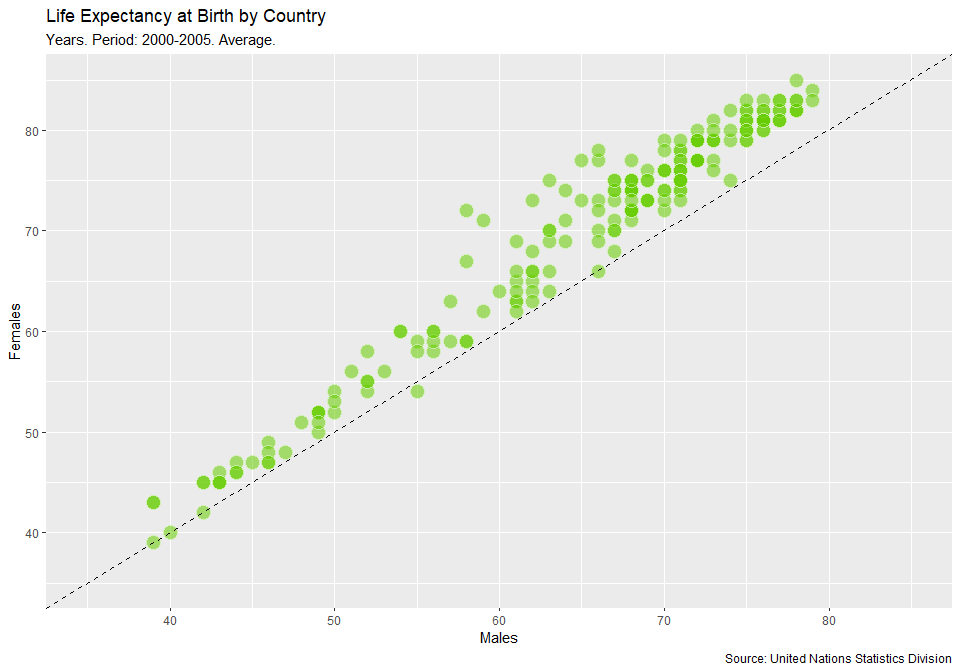
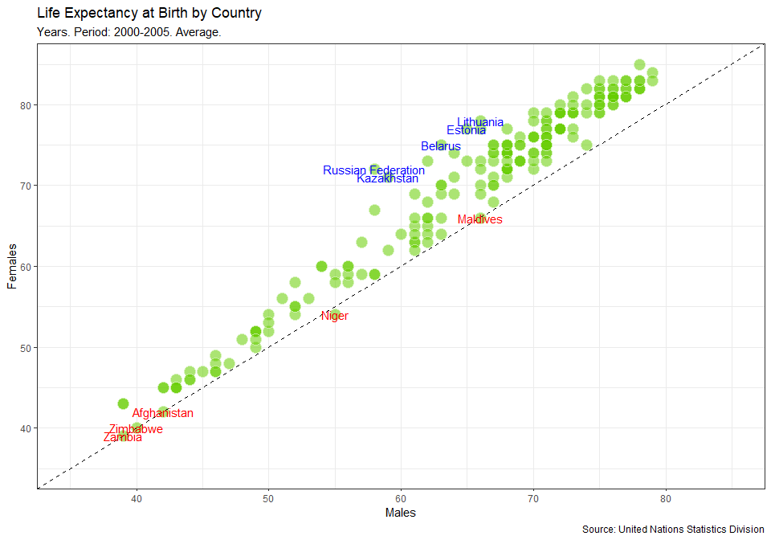

# United Nations life expectancy data
-----------------------------------

## Varun Khanna
### 17 October 2018

#### The Shiny app of the project is available [here](https://discoverdata.shinyapps.io/UN_data/)


``` r
knitr::opts_chunk$set(fig.width = 10, fig.height = 7, fig.path = 'Figs/', warning = FALSE, message = FALSE)
```


Life expectancy at birth is a measure of the average a living being is expected to live. It takes into account several demographic factors like gender, country, or year of birth.

Life expectancy at birth can vary along time or between countries because of many causes: the evolution of medicine, the degree of development of countries, or the effect of armed conflicts. Life expectancy varies between gender, as well. The data shows that women live longer than men. Why? Several potential factors, including biological reasons and the theory that women tend to be more health conscious.

Let's create some plots to explore the inequalities in life expectancy at birth around the world. We will use data from the United Nations Statistics Division, which is available [here](dataset.csv)

``` r
library("tidyverse")
library("knitr")

# Loading data

life_expectancy <- read.csv("dataset.csv", stringsAsFactors = FALSE, header = TRUE)
country_codes <- read.csv("country_codes.csv",sep=",",header = TRUE, stringsAsFactors = FALSE)

kable(head(life_expectancy))
```

| Country.or.Area | Subgroup | Year      | Source                                                          | Unit  |  Value|  Value.Footnotes|
|:----------------|:---------|:----------|:----------------------------------------------------------------|:------|------:|----------------:|
| Afghanistan     | Female   | 2000-2005 | UNPD\_World Population Prospects\_2006 (International estimate) | Years |     42|               NA|
| Afghanistan     | Female   | 1995-2000 | UNPD\_World Population Prospects\_2006 (International estimate) | Years |     42|               NA|
| Afghanistan     | Female   | 1990-1995 | UNPD\_World Population Prospects\_2006 (International estimate) | Years |     42|               NA|
| Afghanistan     | Female   | 1985-1990 | UNPD\_World Population Prospects\_2006 (International estimate) | Years |     41|               NA|
| Afghanistan     | Male     | 2000-2005 | UNPD\_World Population Prospects\_2006 (International estimate) | Years |     42|               NA|
| Afghanistan     | Male     | 1995-2000 | UNPD\_World Population Prospects\_2006 (International estimate) | Years |     42|               NA|

``` r
kable(head(country_codes))
```

| country\_code | is\_independent | currency\_name | status     | landlocked | country        | region  | subregion       | capital          | continent |
|:--------------|:----------------|:---------------|:-----------|:-----------|:---------------|:--------|:----------------|:-----------------|:----------|
| TWN           | Yes             |                |            | No         |                |         |                 | Taipei           | AS        |
| AFG           | Yes             | Afghani        | Developing | Yes        | Afghanistan    | Asia    | Southern Asia   | Kabul            | AS        |
| ALB           | Yes             | Lek            | Developed  | No         | Albania        | Europe  | Southern Europe | Tirana           | EU        |
| DZA           | Yes             | Algerian Dinar | Developing | No         | Algeria        | Africa  | Northern Africa | Algiers          | AF        |
| ASM           | Territory of US | US Dollar      | Developing | No         | American Samoa | Oceania | Polynesia       | Pago Pago        | OC        |
| AND           | Yes             | Euro           | Developed  | No         | Andorra        | Europe  | Southern Europe | Andorra la Vella | EU        |

Life expectancy of men vs. women by country
-------------------------------------------

Let's manipulate the data to make our exploration easier. We will build the dataset for our first plot in which we will represent the average life expectancy of men and women across countries for the last period recorded in our data (2000-2005).

``` r
subdata <- life_expectancy  %>% 
    filter(Year == '2000-2005') %>%
    select(Country.or.Area,Subgroup, Value) %>%

  spread( key = Subgroup, value = Value)
# Taking a look at the first few rows
kable(head(subdata))
```

| Country.or.Area |  Female|  Male|
|:----------------|-------:|-----:|
| Afghanistan     |      42|    42|
| Albania         |      79|    73|
| Algeria         |      72|    70|
| Angola          |      43|    39|
| Argentina       |      78|    71|
| Armenia         |      75|    68|

``` r
names(subdata)[1] <- "country"

# Merge the data with the country_codes
merged <- merge(subdata, country_codes, by = "country")
# Loook at the first few rows of merged dataset
head(merged)
```

    ##       country Female Male country_code is_independent  currency_name
    ## 1 Afghanistan     42   42          AFG            Yes        Afghani
    ## 2     Albania     79   73          ALB            Yes            Lek
    ## 3     Algeria     72   70          DZA            Yes Algerian Dinar
    ## 4      Angola     43   39          AGO            Yes         Kwanza
    ## 5   Argentina     78   71          ARG            Yes Argentine Peso
    ## 6     Armenia     75   68          ARM            Yes  Armenian Dram
    ##       status landlocked   region                       subregion
    ## 1 Developing        Yes     Asia                   Southern Asia
    ## 2  Developed         No   Europe                 Southern Europe
    ## 3 Developing         No   Africa                 Northern Africa
    ## 4 Developing         No   Africa              Sub-Saharan Africa
    ## 5 Developing         No Americas Latin America and the Caribbean
    ## 6 Developing        Yes     Asia                    Western Asia
    ##        capital continent
    ## 1        Kabul        AS
    ## 2       Tirana        EU
    ## 3      Algiers        AF
    ## 4       Luanda        AF
    ## 5 Buenos Aires        SA
    ## 6      Yerevan        AS

Visualize I
-----------

A scatter plot is a useful way to visualize the relationship between the two variables. It is a simple plot in which points are arranged on two axes, each of which represents one of those variables.

Let's create a scatter plot using `ggplot2` to represent life expectancy of males (on the x-axis) against females (on the y-axis). We will create a straightforward plot in this task, without much details. We will take care of these kinds of things shortly.

``` r
# Plotting male and female life expectancy
merged %>% ggplot(mapping = aes(x = Male, y = Female, color = factor(landlocked))) + 
    geom_jitter() + labs(color = "land-locked", x = "Male life expectancy", y = "Female life expectancy")
```


**Note**: Land-locked countries on average have less life expectancy than countries which are not land-locked.

This time, color by region

``` r
# Plotting male and female life expectancy
merged %>% ggplot(mapping = aes(x = Male, y = Female, color = factor(region))) + 
    geom_jitter() + labs(color = "Region", x = "Male life expectancy", y = "Female life expectancy")
```


**Note:** Most African countries are at the bottom left corner indicating that the life expectancy is lower whereas European and American countries are at the top right corner while the majority of the Asian countries are in the middle.

Color by status

``` r
# Plotting male and female life expectancy
merged %>% ggplot(mapping = aes(x = Male, y = Female, color = factor(status))) + 
    geom_jitter() + labs(color = "Country status", x = "Male life expectancy", y = "Female life expectancy")
```


**Note:** Most developed countries have life\_expectancy above 70 whereas there is a long range of life expectancy in developing nations.

Reference lines I
-----------------

A good plot must be easy to understand. There are several tools in `ggplot2` to achieve this goal and we will explore some of them now. Starting from the previous plot, let's set the same limits for both axes as well as place a diagonal line for reference. After doing this, the difference between men and women across countries will be easier to interpret.

After completing this task, we will see how most of the points are arranged above the diagonal and how there is a significant dispersion among them. What does this all mean?

``` r
merged %>% ggplot(mapping = aes(x = Male, y = Female)) + 
  geom_point(position = "jitter") +
  geom_abline(intercept = 0,slope = 1, lty = 2) + 
  xlim(35,85) +
  ylim(35,85) + 
  labs(x = "Male life expectancy", y = "Female life expectancy")
```


**Note:** From the above plot we can conclude that females live longer than males in almost every country.

Plot titles and axis labels
---------------------------

An important point in making the plot understandable is placing clear labels on it. Let's add titles, axis labels and captions to refer to the source of data. Let's also change the appearance to make it clearer.

``` r
# Adding labels to previous plot
ggplot(merged, aes(x = Male, y = Female)) +
  geom_point(colour = "white", fill = "chartreuse3", shape = 21, alpha = .8, size = 3) +
  geom_abline(intercept = 0, slope = 1, linetype = 2) +
  scale_x_continuous(limits = c(35,85)) +
  scale_y_continuous(limits = c(35,85)) + 
  labs(title = "Life Expectancy at Birth by Country",
       subtitle = "Years. Period: 2000-2005. Average.",
       caption = "Source: United Nations Statistics Division",
       x = "Males",
       y = "Females") 
```



Highlighting remarkable countries I
-----------------------------------

Now, we will label some points of our plot with the name of its corresponding country. We want to draw attention to some special countries where the gap in life expectancy between men and women is significantly higher. These will be the final touches on this first plot.

``` r
merged <- mutate(merged, diff_female_male = Female - Male)
shorter_female_longevity <- merged %>% arrange(diff_female_male) %>% head(5)
longer_female_longevity <- merged %>% arrange(desc(diff_female_male)) %>% head(5)

# Adding text to the previous plot to label countries of interest
ggplot(merged, aes(x = Male, y = Female, fill = factor(region))) +
    geom_point(shape = 21,size = 2, position = "jitter") +
    geom_abline(intercept = 0, slope = 1, linetype = 2) +
    scale_x_continuous(limits = c(35,85)) +
    scale_y_continuous(limits = c(35,85)) + 
    labs(title = "Life Expectancy at Birth by Country",
         subtitle = "Years. Period: 2000-2005. Average.",
         caption = "Source: United Nations Statistics Division",
         x = "Males",
         y = "Females") + 

# Add countries with shorter female longevity
  geom_text(data = shorter_female_longevity, label = shorter_female_longevity$country, color = "red") + 
  
# Add countries with longer female longevity
  geom_text(data = longer_female_longevity, label = longer_female_longevity$country, color = "blue") +
# Change the default color scheme and divide the plot based on status
  scale_fill_brewer(palette = "Dark2", name = "Region") + facet_wrap(~status)
```



**Note:** countries in the blue color label have the female life expectancy much higher as compared to male life expectancy whereas countries in red color label have the lower female life expectancy. Most blue countries are developed and former members of USSR while most red counties are African and Asian.

How has life expectancy by gender evolved?
------------------------------------------

Since our data contains historical information, let's see now how life expectancy has evolved in recent years. Our second plot will represent the difference between men and women across countries between two periods: 2000-2005 and 1985-1990. Let's start building a dataset called `subdata2` for our second plot.

``` r
# Filter for year 1985-1990 to 2000-2005
subdata2 <- life_expectancy %>% 
    filter(Year %in% c("1985-1990", "2000-2005")) %>%
  # Substitute - with _ in the year and join with gender
  mutate(sub_year = paste(Subgroup, Year, sep = "_") ) %>%
  mutate(sub_year = gsub("-","_", sub_year)) %>%
  # Remove unwanted columns
  select(-Subgroup, -Year, -Source, -Unit, -Value.Footnotes) %>%
  # spread sub_year
  spread(sub_year, value = Value) %>%
  # Calculate the increase of male and female life expectancy from 1985 - 2005
  mutate(diff_Female = Female_2000_2005 - Female_1985_1990) %>%
  mutate (diff_Male = Male_2000_2005 - Male_1985_1990)

kable(head(subdata2))
```

| Country.or.Area |  Female\_1985\_1990|  Female\_2000\_2005|  Male\_1985\_1990|  Male\_2000\_2005|  diff\_Female|  diff\_Male|
|:----------------|-------------------:|-------------------:|-----------------:|-----------------:|-------------:|-----------:|
| Afghanistan     |                  41|                  42|                41|                42|             1|           1|
| Albania         |                  75|                  79|                69|                73|             4|           4|
| Algeria         |                  67|                  72|                65|                70|             5|           5|
| Angola          |                  42|                  43|                38|                39|             1|           1|
| Argentina       |                  75|                  78|                68|                71|             3|           3|
| Armenia         |                  71|                  75|                66|                68|             4|           2|

``` r
names(subdata2)[1] <- "country"
# Merge the subdata2 with country
merged2 <- merge(subdata2,country_codes, by = "country")

kable(head(merged2))
```

| country     |  Female\_1985\_1990|  Female\_2000\_2005|  Male\_1985\_1990|  Male\_2000\_2005|  diff\_Female|  diff\_Male| country\_code | is\_independent | currency\_name | status     | landlocked | region   | subregion                       | capital      | continent |
|:------------|-------------------:|-------------------:|-----------------:|-----------------:|-------------:|-----------:|:--------------|:----------------|:---------------|:-----------|:-----------|:---------|:--------------------------------|:-------------|:----------|
| Afghanistan |                  41|                  42|                41|                42|             1|           1| AFG           | Yes             | Afghani        | Developing | Yes        | Asia     | Southern Asia                   | Kabul        | AS        |
| Albania     |                  75|                  79|                69|                73|             4|           4| ALB           | Yes             | Lek            | Developed  | No         | Europe   | Southern Europe                 | Tirana       | EU        |
| Algeria     |                  67|                  72|                65|                70|             5|           5| DZA           | Yes             | Algerian Dinar | Developing | No         | Africa   | Northern Africa                 | Algiers      | AF        |
| Angola      |                  42|                  43|                38|                39|             1|           1| AGO           | Yes             | Kwanza         | Developing | No         | Africa   | Sub-Saharan Africa              | Luanda       | AF        |
| Argentina   |                  75|                  78|                68|                71|             3|           3| ARG           | Yes             | Argentine Peso | Developing | No         | Americas | Latin America and the Caribbean | Buenos Aires | SA        |
| Armenia     |                  71|                  75|                66|                68|             4|           2| ARM           | Yes             | Armenian Dram  | Developing | Yes        | Asia     | Western Asia                    | Yerevan      | AS        |

Visualize II
------------

Now let's create our second plot in which we will represent the average **life expectancy differences between "1985-1990" and "2000-2005"** for men and women. Adding reference lines can make plots easier to understand. We will add a diagonal line to visualize differences between men and women more clearly and we will add two more lines to help to identify in which countries people increased or decreased their life expectancy in the period analyzed.

``` r
# Adding an hline and vline to previous plot
ggplot(merged2, aes(x = diff_Male, y = diff_Female, fill = factor(region))) +
  geom_point(shape = 21, size = 2, position = "jitter") +
  geom_abline(intercept = 0, slope = 1, linetype = 2) +
  scale_x_continuous(limits = c(-25,25)) +
  scale_y_continuous(limits = c(-25,25)) +
  geom_hline(yintercept = 0, lty = 2) + 
  geom_vline(xintercept = 0, lty = 2) +
  labs(title = "Life Expectancy at Birth by Country",
       subtitle = "Years. Difference between 1985-1990 and 2000-2005. Average.",
       caption = "Source: United Nations Statistics Division",
       x = "Males",
       y = "Females") +
  theme_bw() + scale_fill_brewer(palette = "Dark2", name = "Region")
```


Highlighting remarkable countries
---------------------------------

Concretely, we will point to those three where the aggregated average life expectancy for men and women increased and decreased most in the period.

``` r
# Subseting data to obtain countries of interest
decreased_life_expectancy <- merged2 %>% arrange(diff_Male+diff_Female) %>% head(3)
increased_life_expectancy <- merged2 %>% arrange(desc(diff_Male+diff_Female)) %>% head(3)
ggplot(merged2, aes(x = diff_Male, y = diff_Female, fill = factor(region))) +
  geom_point(shape = 21, size = 2, position = "jitter") +
  geom_abline(intercept = 0, slope = 1, linetype = 2) +
  scale_x_continuous(limits = c(-25,25)) +
  scale_y_continuous(limits = c(-25,25)) +
  geom_hline(yintercept = 0, lty = 2) + 
  geom_vline(xintercept = 0, lty = 2) +
  labs(title = "Life Expectancy at Birth by Country",
       subtitle = "Years. Difference between 1985-1990 and 2000-2005. Average.",
       caption = "Source: United Nations Statistics Division",
       x = "Males",
       y = "Females") +
  geom_text(data = increased_life_expectancy, label = increased_life_expectancy$country, color = "blue") + 
  geom_text(data = decreased_life_expectancy, label = decreased_life_expectancy$country, color = "red") + 
  theme_bw() + scale_fill_brewer(palette = "Dark2", name = "Region")
```


**Note:** Most life expectancy increase from 1985-2005 was observed in Egypt, Bhutan and Timor Leste (all Asian countries) on the other hand Zimbabwe, Botswana and Swaziland (all African countries) saw a significant drop in life expectancy.

Ok! What about the Indian subcontinent?
---------------------------------------

``` r
indian_subcontinent <- filter(merged2, subregion == "Southern Asia")

# Plot the countries
p <- ggplot(indian_subcontinent, mapping = aes(x = diff_Male, y = diff_Female, label = indian_subcontinent$country)) 
p <- p + geom_text(check_overlap = TRUE, vjust = 0.0, nudge_x = 0.1, nudge_y = 0.2)
p <- p + geom_point()

# Add the reference line
p + geom_abline(intercept = 0, slope = 1, linetype = 2) +
  labs(title = "Life Expectancy at Birth by Country",
         subtitle = "Difference between 1985-1990 and 2000-2005 in Indian subcontinent.",
         caption = "Source: United Nations Statistics Division",
         x = "Males",
         y = "Females") + theme_bw()
```


**Note:** Bangladesh and Bhutan are the best performing countries while Sri Lanka and Afghanistan are at the bottom based on data till 2005.
