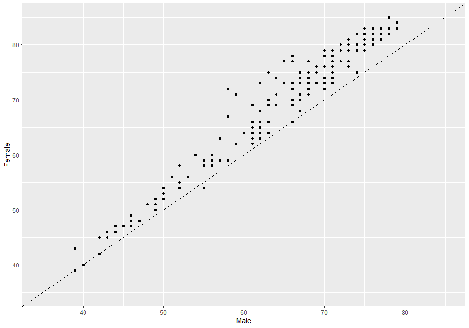
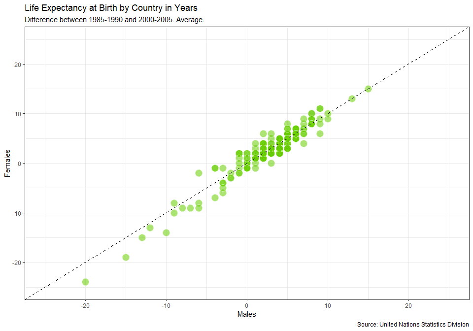
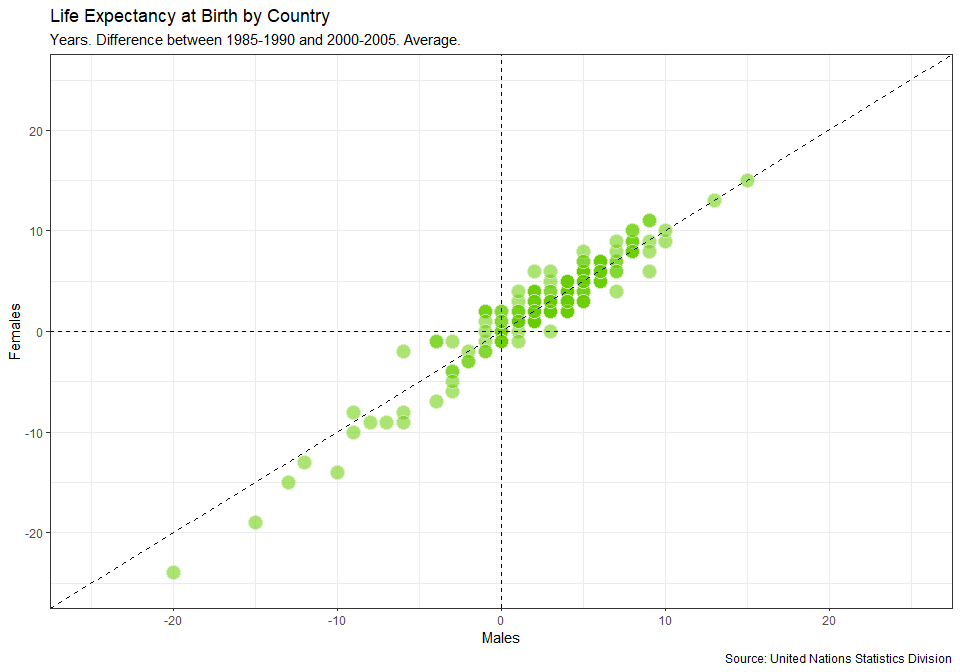
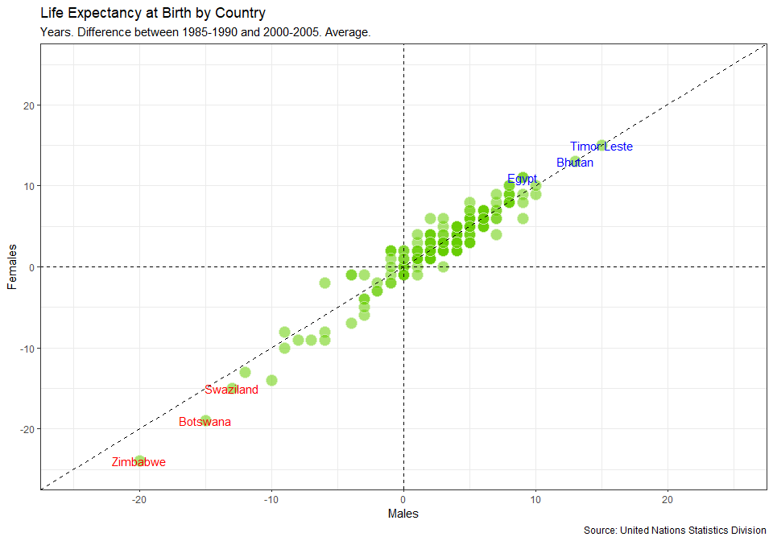

#### The Shiny app of the project is available [here](https://discoverdata.shinyapps.io/UN_data/)

``` r
knitr::opts_chunk$set(fig.width = 10, fig.height = 7, fig.path = 'Figs/', warning = FALSE, message = FALSE)
```

United Nations life expectancy data
===================================

Life expectancy at birth is a measure of the average a living being is
expected to live. It takes into account several demographic factors like
gender, country, or year of birth.

Life expectancy at birth can vary along time or between countries
because of many causes: the evolution of medicine, the degree of
development of countries, or the effect of armed conflicts. Life
expectancy varies between gender, as well. The data shows that women
live longer that men. Why? Several potential factors, including
biological reasons and the theory that women tend to be more health
conscious.

Let’s create some plots to explore the inequalities about life
expectancy at birth around the world. We will use a dataset from the
United Nations Statistics Division, which is available
[here](dataset.csv)

``` r
library("tidyverse")
library("knitr")
library("car")

# Loading data

life_expectancy <- read.csv("dataset.csv", stringsAsFactors = FALSE, header = TRUE)

kable(head(life_expectancy))
```

| Country.or.Area | Subgroup | Year      | Source                                                          | Unit  |  Value|  Value.Footnotes|
|:----------------|:---------|:----------|:----------------------------------------------------------------|:------|------:|----------------:|
| Afghanistan     | Female   | 2000-2005 | UNPD\_World Population Prospects\_2006 (International estimate) | Years |     42|               NA|
| Afghanistan     | Female   | 1995-2000 | UNPD\_World Population Prospects\_2006 (International estimate) | Years |     42|               NA|
| Afghanistan     | Female   | 1990-1995 | UNPD\_World Population Prospects\_2006 (International estimate) | Years |     42|               NA|
| Afghanistan     | Female   | 1985-1990 | UNPD\_World Population Prospects\_2006 (International estimate) | Years |     41|               NA|
| Afghanistan     | Male     | 2000-2005 | UNPD\_World Population Prospects\_2006 (International estimate) | Years |     42|               NA|
| Afghanistan     | Male     | 1995-2000 | UNPD\_World Population Prospects\_2006 (International estimate) | Years |     42|               NA|

Life expectancy of men vs. women by country
-------------------------------------------

Let’s manipulate the data to make our exploration easier. We will build
the dataset for our first plot in which we will represent the average
life expectancy of men and women across countries for the last period
recorded in our data (2000-2005).

``` r
subdata <- life_expectancy  %>% 
    filter(Year == '2000-2005') %>%
    select(Country.or.Area,Subgroup, Value) %>%

  spread( key = Subgroup, value = Value)
# Taking a look at the first few rows
kable(head(subdata))
```

| Country.or.Area |  Female|  Male|
|:----------------|-------:|-----:|
| Afghanistan     |      42|    42|
| Albania         |      79|    73|
| Algeria         |      72|    70|
| Angola          |      43|    39|
| Argentina       |      78|    71|
| Armenia         |      75|    68|

Visualize I
-----------

A scatter plot is a useful way to visualize the relationship between two
variables. It is a simple plot in which points are arranged on two axes,
each of which represents one of those variables.

Let’s create a scatter plot using `ggplot2` to represent life expectancy
of males (on the x-axis) against females (on the y-axis). We will create
a straightforward plot in this task, without many details. We will take
care of these kinds of things shortly.

``` r
# Plotting male and female life expectancy
subdata %>% ggplot(mapping = aes(x = Male, y = Female)) + 
  geom_point()
```


Reference lines I
-----------------

A good plot must be easy to understand. There are many tools in
`ggplot2` to achieve this goal and we will explore some of them now.
Starting from the previous plot, let’s set the same limits for both axes
as well as place a diagonal line for reference. After doing this, the
difference between men and women across countries will be easier to
interpret.

After completing this task, we will see how most of the points are
arranged above the diagonal and how there is a significant dispersion
among them. What does this all mean?

``` r
subdata %>% ggplot(mapping = aes(x = Male, y = Female)) + 
  geom_point() +
  geom_abline(intercept = 0,slope = 1, lty = 2) + 
  xlim(35,85) +
  ylim(35,85)
```



#### Note: From the above plot we can conclude that females live longer than males in almost every country.

Plot titles and axis labels
---------------------------

A key point to make a plot understandable is placing clear labels on it.
Let’s add titles, axis labels, and a caption to refer to the source of
data. Let’s also change the appearance to make it clearer.

``` r
# Adding labels to previous plot
ggplot(subdata, aes(x = Male, y = Female)) +
  geom_point(colour = "white", fill = "chartreuse3", shape = 21, alpha = .55, size = 5) +
  geom_abline(intercept = 0, slope = 1, linetype = 2) +
  scale_x_continuous(limits = c(35,85)) +
  scale_y_continuous(limits = c(35,85)) + 
  labs(title = "Life Expectancy at Birth by Country",
       subtitle = "Years. Period: 2000-2005. Average.",
       caption = "Source: United Nations Statistics Division",
       x = "Males",
       y = "Females")
```


Highlighting remarkable countries I
-----------------------------------

Now, we will label some points of our plot with the name of its
corresponding country. We want to draw attention to some special
countries where the gap in life expectancy between men and women is
significantly high. These will be the final touches on this first plot.

``` r
subdata <- mutate(subdata, diff_female_male = Female - Male)
shorter_female_longevity <- subdata %>% arrange(diff_female_male) %>% head(5)
longer_female_longevity <- subdata %>% arrange(desc(diff_female_male)) %>% head(5)

# Adding text to the previous plot to label countries of interest
ggplot(subdata, aes(x = Male, y = Female)) +
  geom_point(colour = "white", fill = "chartreuse3", shape = 21, alpha = .55, size = 5) +
  geom_abline(intercept = 0, slope = 1, linetype = 2) +
  scale_x_continuous(limits = c(35,85)) +
  scale_y_continuous(limits = c(35,85)) + 
  labs(title = "Life Expectancy at Birth by Country",
       subtitle = "Years. Period: 2000-2005. Average.",
       caption = "Source: United Nations Statistics Division",
       x = "Males",
       y = "Females") + theme_bw() + geom_text(data = shorter_female_longevity, label = shorter_female_longevity$Country.or.Area, color = "red") + 
geom_text(data = longer_female_longevity, label = longer_female_longevity$Country.or.Area, color = "blue")
```


#### Note: countries in the red have have female life expectancy much higher as compared to male life expectancy whereas countries in blue have lower or equal female life expectancy.

How has life expectancy by gender evolved?
------------------------------------------

Since our data contains historical information, let’s see now how life
expectancy has evolved in recent years. Our second plot will represent
the difference between men and women across countries between two
periods: 2000-2005 and 1985-1990. Let’s start building a dataset called
`subdata2` for our second plot.

``` r
# Filter for year 1985-1990 to 2000-2005
subdata2 <- life_expectancy %>% 
    filter(Year %in% c("1985-1990", "2000-2005")) %>%
  # Substitute - with _ in the year and join with gender
  mutate(sub_year = paste(Subgroup, Year, sep = "_") ) %>%
  mutate(sub_year = gsub("-","_", sub_year)) %>%
  # Remove unwanted columns
  select(-Subgroup, -Year, -Source, -Unit, -Value.Footnotes) %>%
  # spread sub_year
  spread(sub_year, value = Value) %>%
  # Calculate the increase of male and female life expectancy from 1985 - 2005
  mutate(diff_Female = Female_2000_2005 - Female_1985_1990) %>%
  mutate (diff_Male = Male_2000_2005 - Male_1985_1990)

kable(head(subdata2))
```

| Country.or.Area |  Female\_1985\_1990|  Female\_2000\_2005|  Male\_1985\_1990|  Male\_2000\_2005|  diff\_Female|  diff\_Male|
|:----------------|-------------------:|-------------------:|-----------------:|-----------------:|-------------:|-----------:|
| Afghanistan     |                  41|                  42|                41|                42|             1|           1|
| Albania         |                  75|                  79|                69|                73|             4|           4|
| Algeria         |                  67|                  72|                65|                70|             5|           5|
| Angola          |                  42|                  43|                38|                39|             1|           1|
| Argentina       |                  75|                  78|                68|                71|             3|           3|
| Armenia         |                  71|                  75|                66|                68|             4|           2|

Visualize II
------------

Now let’s create our second plot in which we will represent average life
expectancy differences between “1985-1990” and “2000-2005” for men and
women.

``` r
# Doing a nice first version of the plot with abline, scaling axis and adding labels
ggplot(subdata2, aes(x = diff_Male, y = diff_Female, label = Country.or.Area)) +
  geom_point(colour = "white", fill = "chartreuse3", shape = 21, alpha = .55, size = 5) +
  geom_abline(intercept = 0, slope = 1, linetype = 2) +
scale_x_continuous(limits = c(-25,25)) +
scale_y_continuous(limits = c(-25,25)) +
  labs(title = "Life Expectancy at Birth by Country in Years",
       subtitle = "Difference between 1985-1990 and 2000-2005. Average.",
       caption = "Source: United Nations Statistics Division",
       x = "Males",
       y = "Females") +
theme_bw()
```



Reference lines II
------------------

Adding reference lines can make plots easier to understand. We already
added a diagonal line to visualize differences between men and women
more clearly. Now we will add two more lines to help to identify in
which countries people increased or decreased their life expectancy in
the period analyzed.

``` r
# Adding an hline and vline to previous plot
ggplot(subdata2, aes(x = diff_Male, y = diff_Female, label = Country.or.Area)) +
  geom_point(colour = "white", fill = "chartreuse3", shape = 21, alpha = .55, size = 5) +
  geom_abline(intercept = 0, slope = 1, linetype = 2) +
  scale_x_continuous(limits = c(-25,25)) +
  scale_y_continuous(limits = c(-25,25)) +
  geom_hline(yintercept = 0, lty = 2) + 
  geom_vline(xintercept = 0, lty = 2) +
  labs(title = "Life Expectancy at Birth by Country",
       subtitle = "Years. Difference between 1985-1990 and 2000-2005. Average.",
       caption = "Source: United Nations Statistics Division",
       x = "Males",
       y = "Females") +
  theme_bw()
```



Highlighting remarkable countries
---------------------------------

Concretely, we will point those three where the aggregated average life
expectancy for men and women increased most and those three where
decreased most in the period.

``` r
# Subseting data to obtain countries of interest
decreased_life_expectancy <- subdata2 %>% arrange(diff_Male+diff_Female) %>% head(3)
increased_life_expectancy <- subdata2 %>% arrange(desc(diff_Male+diff_Female)) %>% head(3)
ggplot(subdata2, aes(x = diff_Male, y = diff_Female, label = Country.or.Area)) +
  geom_point(colour = "white", fill = "chartreuse3", shape = 21, alpha = .55, size = 5) +
  geom_abline(intercept = 0, slope = 1, linetype = 2) +
  scale_x_continuous(limits = c(-25,25)) +
  scale_y_continuous(limits = c(-25,25)) +
  geom_hline(yintercept = 0, lty = 2) + 
  geom_vline(xintercept = 0, lty = 2) +
  labs(title = "Life Expectancy at Birth by Country",
       subtitle = "Years. Difference between 1985-1990 and 2000-2005. Average.",
       caption = "Source: United Nations Statistics Division",
       x = "Males",
       y = "Females") +
  geom_text(data = increased_life_expectancy, label = increased_life_expectancy$Country.or.Area, color = "blue") + 
  geom_text(data = decreased_life_expectancy, label = decreased_life_expectancy$Country.or.Area, color = "red") + 
  theme_bw()
```



**Note: Most life expectancy increase from 1985-2005 was observed in
Egypt, Bhutan and Timor Leste on the other hand Zimbabwe, Botswana and
Swaziland saw a significant drop in life expectancy.**

Who lives longer: Male or Female?
---------------------------------

Traditionally, average life expectancy of males was lower as compared to
females due to regular conflicts and wars. Since the conflicts are
mostly resolved through talks and diplomats these days we would expect
to see the increase in life expectancy of males and females. We observed
increase in life expectancy in general and also observed that in most of
the counties Females live longer than Males but is there a statistically
significant difference in average life expectancy of male and female?
Let us find out.

``` r
# Summary statistics of males life expectancy
subdata %>% summarise(Male_Min = min(Male, na.rm = TRUE), Male_Q1 = quantile(Male, probs = 0.25, na.rm = TRUE), Male_Median = median(Male, na.rm = TRUE), Male_Q3 = quantile(Male, probs = 0.75, na.rm = TRUE), Male_Max = max(Male, na.rm = TRUE), Male_Mean = mean(Male, na.rm = TRUE), Male_SD = sd(Male, na.rm = TRUE), Male_n = n(), Male_Missing = sum(is.na(Male))) %>% kable()
```

|  Male\_Min|  Male\_Q1|  Male\_Median|  Male\_Q3|  Male\_Max|  Male\_Mean|  Male\_SD|  Male\_n|  Male\_Missing|
|----------:|---------:|-------------:|---------:|----------:|-----------:|---------:|--------:|--------------:|
|         39|        58|            68|        72|         79|    64.65128|  10.52251|      195|              0|

``` r
subdata %>% summarise(Female_Min = min(Female, na.rm = TRUE), Female_Q1 = quantile(Female, probs = 0.25, na.rm = TRUE), Female_Median = median(Female, na.rm = TRUE), Female_Q3 = quantile(Female, probs = 0.75, na.rm = TRUE), Female_Max = max(Female, na.rm = TRUE), Female_Mean = mean(Female, na.rm = TRUE), Female_SD = sd(Female, na.rm = TRUE), Female_n = n(), Female_Missing = sum(is.na(Female))) %>% kable()
```

|  Female\_Min|  Female\_Q1|  Female\_Median|  Female\_Q3|  Female\_Max|  Female\_Mean|  Female\_SD|  Female\_n|  Female\_Missing|
|------------:|-----------:|---------------:|-----------:|------------:|-------------:|-----------:|----------:|----------------:|
|           39|        62.5|              74|          79|           85|      69.42564|     11.7613|        195|                0|

The summary statistics shows the average life expectancy of males in 195
countries is 64.65 years whereas for females is 69.42 years. This means
on an avergae females live 4.77 years longer than males.

``` r
par(mfrow = c(1,3))
subdata %>% boxplot(.$Male, .$Female, main = "Average life expectancy of Male and Females", data = ., names = c("Male","Female"), ylab = "Average life expectancy")

hist(subdata$Male, main = "Male life expectancy", probability = TRUE, ylab = "Probability", xlab = "Male")
rnorm_male <- rnorm(nrow(subdata), mean = mean(subdata$Male), sd = sd(subdata$Male))
lines(density(rnorm_male))

hist(subdata$Female, main = "Female life expectancy", probability = TRUE, ylab = "Probability", xlab = "Female")
rnorm_female <- rnorm(nrow(subdata), mean = mean(subdata$Female), sd = sd(subdata$Female))
lines(density(rnorm_female))
```


``` r
par(mfrow = c(1,2))
qqPlot(subdata$Male, ylab = "Male Average Life Expectancy", distribution = "norm")
```

    ## [1]   4 156

``` r
qqPlot(subdata$Female, ylab = "Female Average Life Expectancy", distribution = "norm")
```


    ## [1] 194 195

The QQ-Plots show that data for male and female life expectancy is not
normally distributed.

### Hypothesis testing

1.  Since we are comparing life expectancy of male and female from same
    countries, we can use paired sample t-test for hypothesis testing.
2.  Life expectancy of both males and females are not normally
    distributed. This is clear from histogram and QQ-Plot. However,
    there are 195 countries which is greater than 30, so we can continue
    with paired sample t-test based on Central Limit Theorem.

*μ*1 = Male life expectancy average in years

*μ*2 = Female life expectancy average in years

*μ**δ* = *μ*1 - *μ*2

**H<sub>0</sub>** : *μ**δ* ≥ 0 (Male life expectancy is greater than or
equal to female life expectancy)

**H<sub>A</sub>** : *μ**δ* \< 0 (Female life expectancy is greater than
male life expectancy)

Significance level : 1.00%

We assume that mean life expectancy of male is greater than or equal to
female unless we have p-value less than 0.01. Thus we have set p-value
\< 0.01 as the level of significance for this investigation.

``` r
t.test(subdata$Male, subdata$Female, paired = TRUE, conf.level = 0.95, alternative = "less")
```

    ## 
    ##  Paired t-test
    ## 
    ## data:  subdata$Male and subdata$Female
    ## t = -26.52, df = 194, p-value < 2.2e-16
    ## alternative hypothesis: true difference in means is less than 0
    ## 95 percent confidence interval:
    ##       -Inf -4.476819
    ## sample estimates:
    ## mean of the differences 
    ##               -4.774359

#### T-test interpretation

A paired samples t-test was used to test for a significant mean
difference in life expectancy of male and female. Mean difference of
life expectancy between males and females was found to be -4.77 years.
It indicates that females live 4.77 years longer than males. p-value of
this hypothesis test is 2.2e-16 which is much lower than 0.01
significance level. Based on the p-value, we reject null hypothesis that
male life expectancy can be greater than or equal to female life
expectancy.

Conclusion
----------

On average Females live longer than males. The mean difference between
the life expectancy of females and males is statistically significant.
